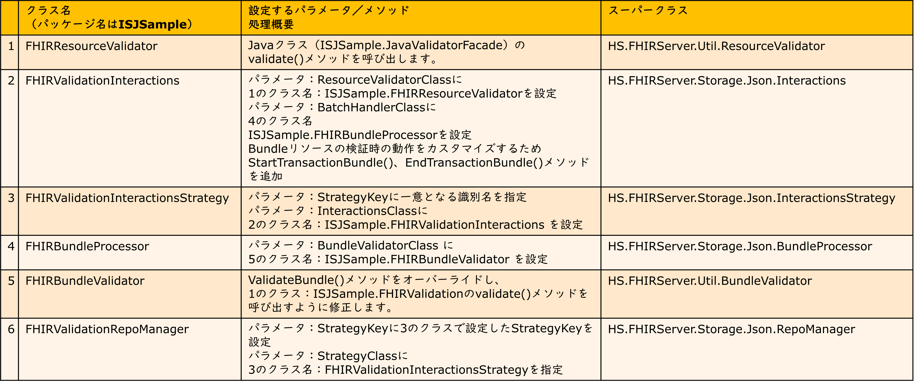
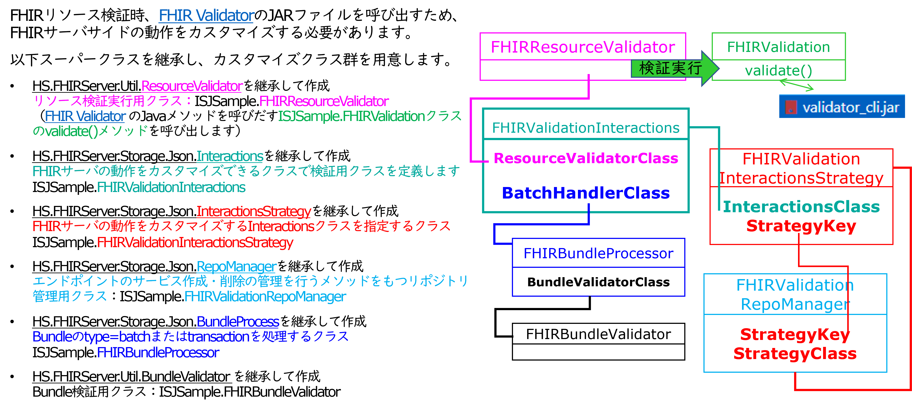
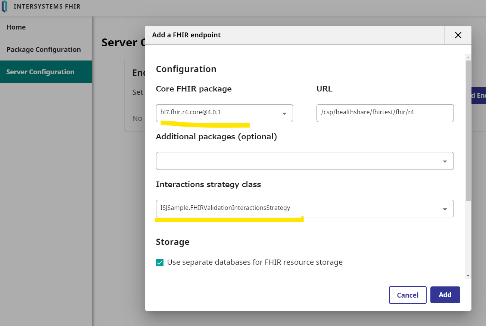
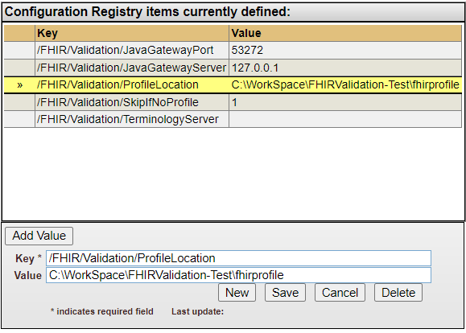

# FHIR Validatorを使うまでの手順

詳細はこちらのページ[https://confluence.hl7.org/display/FHIR/Using+the+FHIR+Validator](https://confluence.hl7.org/display/FHIR/Using+the+FHIR+Validator)をご覧ください。

IRISのFHIRリポジトリからFHIR Validatorを利用する流れのイメージは以下の図の通りです。


## [1]JARダウンロード

validator_cli.jar を [https://github.com/hapifhir/org.hl7.fhir.core/releases/latest/download/validator_cli.jar](https://github.com/hapifhir/org.hl7.fhir.core/releases/latest/download/validator_cli.jar) からダウンロードし、[lib](lib)に配置（配置は任意ディレクトリ可。サンプルでは、[compile.bat](compile.bat)の中でJARの場所を指定してるので、この例では[lib](lib)以下に配置）

## [2]JDKのバージョン

[https://confluence.hl7.org/pages/viewpage.action?pageId=35718580#UsingtheFHIRValidator-JDKVersion](https://confluence.hl7.org/pages/viewpage.action?pageId=35718580#UsingtheFHIRValidator-JDKVersion)

実行例は、OpenJDK11を利用

## [3]IRIS用Javaファイルの準備（Windowsでの例で記載します）

1. 事前準備

    JAVA_HOMEにJavaインストールディレクトリを設定する

2. [JavaValidatorFacade.java](java/ISJSample/JavaValidatorFacade.java) をコンパイルする

    ```
    .\compile.bat
    ```

3. IRIS用Jarファイルを作る

    ```
    .\updateJar.bat
    ```

## [4]検証のテスト

サンプルファイルを利用してテスト

サンプル：[test_Patient.json](sample/test_Patient.json)

実行例）.\run.bat <プロファイルのJSONがあるディレクトリ> <テストするリソースのJSON>

《メモ》　run.bat の第1引数はカスタムプロファイル用ファイルを配置する予定のディレクトリを指定します（空でも実行できます）。例では、[fhirprofile](fhirprofile)を指定しています。

```
PS C:\WorkSpace\FHIRValidation-Test> .\run.bat C:\WorkSpace\FHIRValidation-Test\fhirprofile\ C:\WorkSpace\FHIRValidation-Test\sample\test_Patient.json

C:\WorkSpace\FHIRValidation-Test>"C:\Program Files\jdk-11\bin\java" -cp lib\validator_cli.jar;lib\JavaValidatorFacade.jar ISJSample.JavaValidatorFacade C:\WorkSpace\FHIRValidation-Test\fhirprofile\ C:\WorkSpace\FHIRValidation-Test\sample\test_Patient.json
  Load C:\WorkSpace\FHIRValidation-Test\fhirprofile\ - 64 resources (00:03.110)
  Validate C:\WorkSpace\FHIRValidation-Test\sample\test_Patient.json
Validate Patient against http://hl7.org/fhir/StructureDefinition/Patient..........20..........40..........60..........80.........|
 00:00.358

Success: 0 errors, 0 warnings, 1 notes

{
  "resourceType" : "OperationOutcome",
  "text" : {
    "status" : "extensions",
    "div" : "<div xmlns=\"http://www.w3.org/1999/xhtml\"><p>All OK</p><table class=\"grid\"><tr><td><b>Severity</b></td><td><b>Location</b></td><td><b>Code</b></td><td><b>Details</b></td><td><b>Diagnostics</b></td></tr><tr><td>INFORMATION</td><td/><td>Informational Note</td><td>All OK</td><td/></tr></table></div>"
  },
  "extension" : [{
    "url" : "http://hl7.org/fhir/StructureDefinition/operationoutcome-file",
    "valueString" : "C:\\WorkSpace\\FHIRValidation-Test\\sample\\test_Patient.json"
  }],
  "issue" : [{
    "severity" : "information",
    "code" : "informational",
    "details" : {
      "text" : "All OK"
    }
  }]
}
```


[test_Patient.json](sample/test_Patient.json) 15行目の gender に不正な値（例では"Man"）を設定し、検証エラーが発生するか確認


```
PS C:\WorkSpace\FHIRValidation-Test> .\run.bat C:\WorkSpace\FHIRValidation-Test\fhirprofile\ C:\WorkSpace\FHIRValidation-Test\sample\test_Patient.json

C:\WorkSpace\FHIRValidation-Test>"C:\Program Files\jdk-11\bin\java" -cp lib\validator_cli.jar;lib\JavaValidatorFacade.jar ISJSample.JavaValidatorFacade C:\WorkSpace\FHIRValidation-Test\fhirprofile\ C:\WorkSpace\FHIRValidation-Test\sample\test_Patient.json
  Load C:\WorkSpace\FHIRValidation-Test\fhirprofile\ - 64 resources (00:03.179)
  Validate C:\WorkSpace\FHIRValidation-Test\sample\test_Patient.json
Validate Patient against http://hl7.org/fhir/StructureDefinition/Patient..........20..........40..........60..........80.........|
 00:00.388

*FAILURE*: 1 errors, 0 warnings, 0 notes

{
  "resourceType" : "OperationOutcome",
  "text" : {
    "status" : "extensions",
    "div" : "<div xmlns=\"http://www.w3.org/1999/xhtml\"><table class=\"grid\"><tr><td><b>Severity</b></td><td><b>Location</b></td><td><b>Code</b></td><td><b>Details</b></td><td><b>Diagnostics</b></td><td><b>Source</b></td></tr><tr><td>ERROR</td><td/><td>Invalid Code</td><td>The value provided ('Man') is not in the value set 'AdministrativeGender' (http://hl7.org/fhir/ValueSet/administrative-gender|4.0.1), and a code is required from this value set) (error message = Unknown Code http://hl7.org/fhir/administrative-gender#Man in http://hl7.org/fhir/administrative-gender)</td><td/><td>No display for Extension</td></tr></table></div>"
  },
  "extension" : [{
    "url" : "http://hl7.org/fhir/StructureDefinition/operationoutcome-file",
    "valueString" : "C:\\WorkSpace\\FHIRValidation-Test\\sample\\test_Patient.json"
  }],
  "issue" : [{
    "extension" : [{
      "url" : "http://hl7.org/fhir/StructureDefinition/operationoutcome-issue-line",
      "valueInteger" : 10
    },
    {
      "url" : "http://hl7.org/fhir/StructureDefinition/operationoutcome-issue-col",
      "valueInteger" : 21
    },
    {
      "url" : "http://hl7.org/fhir/StructureDefinition/operationoutcome-issue-source",
      "valueCode" : "TerminologyEngine"
    },
    {
      "url" : "http://hl7.org/fhir/StructureDefinition/operationoutcome-message-id",
      "valueCode" : "Terminology_TX_NoValid_16"
    }],
    "severity" : "error",
    "code" : "code-invalid",
    "details" : {
      "text" : "The value provided ('Man') is not in the value set 'AdministrativeGender' (http://hl7.org/fhir/ValueSet/administrative-gender|4.0.1), and a code is required from this value set) (error message = Unknown Code http://hl7.org/fhir/administrative-gender#Man in http://hl7.org/fhir/administrative-gender)"
    },
    "expression" : ["Patient.gender"]
  }]
}
```

検証初回実行時、プロファイルのパッケージがない場合、[https://confluence.hl7.org/display/FHIR/FHIR+Package+Cache](https://confluence.hl7.org/display/FHIR/FHIR+Package+Cache) からスキーマをダウンロードするため初回のみ時間がかかります。

Windows の場合、以下ディレクトリに保存されます（通常のユーザの場合）。

- **C:\Users\<username>\.fhir**

Linuxの場合は、以下ディレクトリに保存されます。
- **~/.fhir**


## [5]ISJSample.JavaValidatorFacade クラスを実行するためJava用外部サーバを起動

実行環境に合わせて設定を追加します。

**管理ポータル > システム管理 > 構成 > 接続性 > External Lanaugae Server > %Java Server**

|設定項目|値|
|--|--|
|クラスパス|**validator_cli.jarとJavaValidatorFacade.jarのパス**|
|Java Home Directory|Javaのインストールディレクトリ|


設定が終わったら startを押すと以下のようなログが表示されます。

```
Start External Language Server %Java Server:
お待ちください...結果が以下に表示されます:
2022-10-07 19:48:59  Starting Java Gateway Server '%Java Server'
2022-10-07 19:48:59  Executing O.S. command: C:\Program Files\jdk-11\bin\java.exe -Xrs -Djava.system.class.loader=com.intersystems.gateway.ClassLoader -classpath C:\WorkSpace\FHIRValidation-Test\lib\validator_cli.jar;C:\WorkSpace\FHIRValidation-Test\lib\JavaValidatorFacade.jar;C:\InterSystems\IRISHealth\dev\java\lib\1.8\intersystems-jdbc-3.3.1.jar com.intersystems.gateway.JavaGateway 53272 "" "JP7430MIIJIMA:IRISHEALTH:%Java Server" 127.0.0.1 ""
2022-10-07 19:49:10  Execution returned: ''
2022-10-07 19:49:10  Gateway Server start-up confirmation skipped
2022-10-07 19:49:10  Starting background process to monitor the Gateway Server
2022-10-07 19:49:10  Job command successful, started monitor process '26376'
```

## [6]FHIRリポジトリのカスタマイズ用クラスの準備

詳細は、[FHIRサーバのカスタマイズ](https://docs.intersystems.com/irisforhealthlatest/csp/docbookj/DocBook.UI.Page.cls?KEY=HXFHIR_server_customize_arch) をご参照ください。

**！！FHIRリポジトリを作成する前に、ネームスペースにカスタマイズ用クラス群を準備する必要があります！！**

サンプルでは、以下の説明に登場するクラス群を[ISJSample](/ISJSample/)以下に用意しています。

1. クラス一覧



それぞれのクラスの関係は以下のイメージです。



2. 作成したクラスにパラメータを設定

  **最初から作成される場合は、以下のクラスパラメータを設定してください。サンプルをそのままご利用いただく場合は修正不要です。**

  1で作成したクラスにパラメータを設定します。

  - ISJSample.FHIRValidationInteractions クラス
    - **ResourceValidatorClass**に検証実行用カスタムクラス名（ISJSample.FHIRResourceValidator）を指定
    - **BatchHandlerClass**にBundleのtype=batchまたはtransactionを処理するカスタムクラス名（ISJSample.FHIRBundleProcessor）を指定
  
  - ISJSample.FHIRValidationInteractionsStrategy クラス
    - **StrategyKey**にInteractionsStrategyの一意の識別子を指定
    - **InteractionsClass**にInteractionsのカスタムクラス名（ISJSample.FHIRValidationInteractions）を指定
  
  - ISJSample.FHIRBundleProcessor クラス
    - **BundleValidatorClass**にBundle検証用カスタムクラス名（ISJSample.FHIRBundleValidator）を指定

  - ISJSample.FHIRValidationRepoManager クラス
    - **StrategyClass**に InteractionStrategyのカスタムクラス名（ISJSample.FHIRValidationInteractionsStrategy）を指定
    - **StrategyKey**に**InteratcionsStrategyで指定したStrategyKeyの値を指定**

  
  
《補足》

この他、[ISJSample.FHIRValidationInteractions](/ISJSample/FHIRValidationInteractions.cls)クラスと[ISJSample.FHIRResourceValidator](/ISJSample/FHIRResourceValidator.cls)クラスでメソッドをオーバーライドしています。

- [ISJSample.FHIRValidationInteractions](/ISJSample/FHIRValidationInteractions.cls)クラスでは、Bundleに含まれるリソースに対して検証が2回呼び出されないように StartTransactionBundle()メソッドとEndTransactionBundle()メソッドのオーバーライドしています。

  %inTransactionFlag変数の設定を追加

  ```
  Method StartTransactionBundle(pBundleTransactionId As %Integer)
  {
      do ##super(pBundleTransactionId)
      set %inTransactionFlag=$$$YES
  }

  Method EndTransactionBundle()
  {
    kill %inTransactionFlag
      do ##super()
  }
    ```

- [ISJSample.FHIRResourceValidator](/ISJSample/FHIRResourceValidator.cls)クラスでは、ValidateResource()をオーバーライドしています。

  %inTransactionFlgが$$$YES ではないとき、検証を実行するように変更
  ```
  Method ValidateResource(pResourceObject As %DynamicObject)
  {
    //do ##super(pResourceObject)
      if $get(%inTransactionFlag,$$$NO)'=$$$YES {
          do ##class(ISJSample.FHIRValidation).validate(pResourceObject)
      }
  }
  ```

- [ISJSample.FHIRBundleValidator](/ISJSample/FHIRBundleValidator.cls)
  クラスでは、スーパークラスのValidateBundle()をオーバーライドし、ISJSample.FHIRValidationクラスのvalidate()を呼び出しています。

  ```
  ClassMethod ValidateBundle(pResourceObject As %Library.DynamicObject, pFHIRVersion As %String)
  {
      //do ##super(pResourceObject,pFHIRVersion)
      do ##class(ISJSample.FHIRValidation).validate(pResourceObject)
  }
  ```

3. カスタム検証用クラス（ISJSample.FHIRResourceValidator）の修正

  **最初から作成される場合は、以下のクラスパラメータを設定してください。サンプルをそのままご利用いただく場合は修正不要です。**


  スーパークラスのValidateResource()をオーバーライドし、[ISJSample.FHIRValidation](/ISJSample/FHIRValidation.cls)クラスのvalidate()を呼びしています。


4. カスタム検証用クラスが使用するパラメータ値の設定

  **管理ポータル > Health > 作成したネームスペース > Configuration Registry** に移動して以下のKeyとValueを設定します。

  項目名（Key） |設定例(Value)
  --|--|
  /FHIR/Validation/SkipIfNoProfile|1
  /FHIR/Validation/JavaGatewayServer|127.0.0.1
  /FHIR/Validation/JavaGatewayPort|53272（LanguageServer起動後に表示されるポートを指定する）
  /FHIR/Validation/ProfileLocation|C:\WorkSpace\FHIRValidation-Test\fhirprofile
  /FHIR/Validation/TerminologyServer|（設定なし）


## [7]FHIRリポジトリの作成

  InteratcionsStrategyクラスのカスタムクラスがコンパイル済であることを確認し、以下GUIで作成します。

  **管理ポータル > Health > 作成したネームスペース > FHIR Configuration > Server Configuration > Add Endpoint**

  

  **！！Interactions sterategy classに作成したクラス名: ISJSample.FHIRValidationInteractionsStrategyを指定してからリポジトリを作成して下さい！！**

  リポジトリ作成後、デバッグモードから認証なし設定します（Debuggingの「Allow Unauthenticated Access」にチェック）


## [8]テスト実行

  Postmanで以下実行します。

  設定項目|値
  --|--|
  URL|<エンドポイント>/Patient/$validate
  Method|POST
  Header|Content-Type に application/json+fhir;charset=utf-8
  Body|[PatientリソースのJSON](sample/test_Patient.json)

  結果は[[4]検証のテスト](#4検証のテスト)と同じになる


  Bundleの場合は以下の通りです。
  設定項目|値
  --|--|
  URL|<エンドポイント>/Bundle/$validate
  Method|POST
  Header|Content-Type に application/json+fhir;charset=utf-8
  Body|[Bundle用JSON](sample/test_Bundle_Patient_Observation.json)

---

## [9]JPCoreのプロファイルを適用する方法

1. JPCoreのアーティファクトを用意する

公開されているJPCoreのプロファイル [FHIR JP Core 実装ガイド](https://jpfhir.jp/jpcoreV1/)パッケージをダウンロードされるか、[公式Git](https://github.com/jami-fhir-jp-wg/jp-core-draft.git) を clone して、SUSHIを利用してImplementation Guide（IG）などのJSONのファイル群（アーティファクト）を作成する方法があります。

*参照元：[HL7FHIR JP Core実装ガイド＜Draft Ver.1＞の公開について(ご案内)](https://www.nexehrs-cpc.jp/hl7fhir-jp-core%e5%ae%9f%e8%a3%85%e3%82%ac%e3%82%a4%e3%83%89%ef%bc%9cdraft-ver-1%ef%bc%9e%e3%81%8c%e5%85%ac%e9%96%8b%e3%81%95%e3%82%8c%e3%81%be%e3%81%97%e3%81%9f%e3%80%82/)*

**以下例は、2022年10月19日にダウンロードした[FHIR JP Core 実装ガイド](https://jpfhir.jp/jpcoreV1/) V1.1のパッケージを利用して記述しています。**

2.　1.で用意したアーティファクトをプロファイル配置用ディレクトリにコピーして検証を実行する

単体テストする場合は、[run.bat](/run.bat) の第1引数にアーティファクトがあるディレクトリを指定します。

例では、 [FHIR JP Core 実装ガイド](https://jpfhir.jp/jpcoreV1/) にある V1.1のtgz版をダウンロードして展開したディレクトリにあるJSONファイルを [fhirprofile](/fhirprofile)以下にコピーした状態で実行しています。

```
.\run.bat C:\WorkSpace\FHIRValidation-Test\fhirprofile C:\WorkSpace\FHIRValidation-Test\sample\test_Patient-JPCore.json
```

実行に指定している[test_Patient-JPCore.json](sample/test_Patient-JPCore.json)には、JPCoreが定義しているextension.Race（患者の人種）の情報が含まれます。

例）
```
  "birthDate": "1970-01-01",
  "extension":[
    {
        "url": "http://jpfhir.jp/fhir/core/Extension/StructureDefinition/JP_Patient_Race",
        "valueCodeableConcept": {
            "coding": [
                {
                    "system": "http://terminology.hl7.org/CodeSystem/v3-Race",
                    "code": "2039-6",
                    "display": "Japanese"
                }
            ]
        }
    }
  ],
```

3.　IRISから実行する。

実行前にカスタムプロファイルのアーティファクトがあるディレクトリが正確に設定されているか確認します。

**IRISの管理ポータル > Health > ネームスペース選択 > Configuration Registry > /FHIR/Validation/ProfileLocation Valueを確認**



《メモ》　Configuration Registry の **Key** には、[ISJSample.FHIRValidation](ISJSample/FHIRValidation.cls)クラスに定義されているパラメータ名を設定しています。

**Value** の取得は以下ユーティリティクラスのメソッドを実行することで取得できます。
```
##class(HS.Registry.Config).GetKeyValue(..#ProfileLocationKEY)
```

設定値が管理ポータルで変更できるので、プロファイルを参照する場所を変える場合は、**/FHIR/Validation/ProfileLocation** を変更するだけでOKです。

以下、Postmanからのテスト例です。

  設定項目|値
  --|--|
  URL|<エンドポイント>/Patient/$validate
  Method|POST
  Header|Content-Type に application/json+fhir;charset=utf-8
  Body|[JPCore対応用PatientリソースのJSON](sample/test_Patient-JPCore.json)


検証がOKであることを確認したら、JPCoreのプロファイルを正しく認識しているかどうかテストするため、患者の人種（Race）の情報に誤ったデータタイプの情報を設定し検証します。

RaceのデータタイプはExtension(CodeableConcept)が指定されているため、valueCodeableConceptにCodeableConceptタイプの情報を持つ必要がありますが、以下の例では、valueStringにstringの情報を設定しています。

```
  "extension":[
    {
        "url": "http://jpfhir.jp/fhir/core/Extension/StructureDefinition/JP_Patient_Race",
        "valueString":"日本人"
    }
  ],
```
以下、Postmanからのテスト例です。

  設定項目|値
  --|--|
  URL|<エンドポイント>/Patient/$validate
  Method|POST
  Header|Content-Type に application/json+fhir;charset=utf-8
  Body|[JPCore対応用PatientリソースのJSON：検証失敗用](sample/test_Patient-JPCore-invalid.json)

---
*例と同様に、JPCore V1.1のtgz版プロファイルを利用している場合のPatientリソース内タイプの確認については、[https://jpfhir.jp/fhir/core/V1B/StructureDefinition-jp-patient.html](https://jpfhir.jp/fhir/core/V1B/StructureDefinition-jp-patient.html) をご参照ください。*

---

RESTクライアントからの実行結果は以下の通りです。(CodeableConceptのタイプではなくstringの情報が来ていることでエラーが発生しています)

```
{
    "resourceType": "OperationOutcome",
    "issue": [
        {
            "severity": "error",
            "code": "structure",
            "diagnostics": "5001",
            "details": {
                "text": "This element does not match any known slice  defined in the profile http://jpfhir.jp/fhir/core/Extension/StructureDefinition/JP_Patient_Race and slicing is CLOSED: Patient.extension[0].value.ofType(string): Does not match slice 'valueCodeableConcept' (discriminator: ($this is CodeableConcept))"
            },
            "expression": [
                "Patient.extension[0].value.ofType(string)"
            ]
        },
        {
            "severity": "error",
            "code": "structure",
            "diagnostics": "5001",
            "details": {
                "text": "The Extension 'http://jpfhir.jp/fhir/core/Extension/StructureDefinition/JP_Patient_Race' definition allows for the types [CodeableConcept] but found type string"
            },
            "expression": [
                "Patient.extension[0]"
            ]
        }
    ]
}
```

以上です